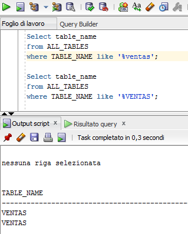

# Ejercicios FBD (practica)

--------------------------------------------------------------------------------

## Tema 2

### Ejercicio 2.1

contenido del fichero pp.sql:

```
    CREATE TABLE prueba2(
            cad1 char(8),
            num int
        );
```

### Ejercicio 2.2

 

### Ejercicio 2.3

Lista completa de los datatypes ofrecidos por Oracle:

- CHAR (size [BYTE|CHAR])
- NCHAR (size)
- VARCHAR2 (size [BYTE|CHAR])
- NVARCHAR2 (size)
- NUMBER [ (p [, s]) ]
- FLOAT [(p)]
- LONG
- DATE
- BINARY_FLOAT
- BINARY_DOUBLE
- TIMESTAMP [(fractional_seconds_precision)]
- TIMESTAMP [(fractional_seconds_precision)] WITH TIME ZONE
- TIMESTAMP [(fractional_seconds_precision)] WITH LOCAL TIME ZONE
- INTERVAL YEAR [(year_precision)] TO MONTH
- INTERVAL DAY [(day_precision)] TO SECOND [(fractional_seconds_precision)]
- RAW(size)
- LONG RAW
- ROWID
- UROWID[(size)]
- CHAR [(size [BYTE | CHAR])]
- NCHAR[(size)]
- CLOB
- NCLOB
- BLOB
- BFILE

### Ejercicio 2.4

El diagrama E/R que recoge la semantica de las tablas _planitlla_ y _serjefe_ es muy sencillo: _serjefe_ es una relacion involutiva de _plantilla_, relacion de uno a mucho en la que un elemento de _plantilla_ (identificado por _dnijefe_) puede SER JEFE de muchos otros elementos de _plantilla_ (identificados por _dnitrabajador_).


### Ejercicio 2.5

Una vez borrada la tabla _prueba1_, se puede ejecutar una query _SELECT_ para ver todas las tablas que se quedan

```
    DROP TABLE prueba1;
    SELECT table_name FROM user_tables;
```


### Ejercicio 2.6

```
    ALTER TABLE plantilla ADD(fechabaja DATE);
```

### Ejercicio 2.7

```
    ALTER TABLE ventas ADD(fecha DATE);
```


### Ejercicio 2.8


### Ejercicio 2.9

```
    UPDATE plantilla SET NOMBRE = 'Luis' WHERE DNI = '12345678';
```


### Ejercicio

No se pueden borrar todas las tuplas de la tabla _plantilla_. Esto porque hay conflicto de dependencia entre la tabla _plantilla_ y la tabla _serjefe_ porque la segunda tiene claves externas de la prima.


Sin embrargo, si se pueden borrar todas las tuplas de la tabla _serjefe_ porque no hay conflicto de dependencia.


### Ejercicio 2.11

Supongamos que queremos aniadir las siguientes tuplas a la tabla _ventas_:

```
INSERT INTO VENTAS VALUES ('S3','P1','J1',150,'24/12/05');
INSERT INTO VENTAS(CODPRO,CODPJ) VALUES ('S4','J2');
INSERT INTO VENTAS VALUES ('S5','P3','J6',400,TO_DATE('25/12/00'));
```

Se puede razonar que:

- la primera tiene clave primaria ya existente, entonces no se puede insertar
- la segunda falta de una clave externa, es decir intenta insertar clave externa de valor nulo y por esto no se puede insertar
- la tercera tiene un formato no valido para la fecha, y por esto no se puede insertar


### Ejercicio 2.12

```
UPDATE ventas SET fecha = TO_DATE(2005,'YYYY') WHERE codpro='S5';
```


### Ejercicio 2.13


### Ejercicios Adicionales

#### Ejercicio 2.11.1

Nos piden de crear una base de datos dado el esquema siguiente:

- Equipos (<ins>codE</ins>, nombreE, localidad, entrenador, fecha_crea)
- Jugadores (<ins>codJ</ins>, codE, nombreJ)
- Encuentros(<ins>eq1, eq2</ins>, fecha, res1,res2)
- Faltas (<ins>codJ, eq1, eq2</ins>, num)

Y con las relativas restricciones:

- Equipos: No se debe permitir que ninguno de los atributos tome valor nulo, además, el nombre del equipo ha de ser único.
- Jugadores: No se debe permitir valor nulo ni en nombreJ, ni en el equipo al que pertenece.
- Encuentros: Los encuentros se realizan entre equipos de la liga, cada uno de los atributos eq1 y eq2 es clave externa a la tabla Equipos. Los resultados res1 y res2 (tantos marcados por eq1 y por eq2, respectivamente) han de ser positivos y tomar 0 como valor por defecto.
- Faltas: Representan la cantidad de faltas personales cometidas por un jugador en el encuentro indicado. El conjunto de atributos formado por eq1 y eq2 son clave externa a la tabla Encuentros y el atributo codJ es clave externa a la tabla Jugadores. El número de faltas num estará comprendido entre 0 y 5, ambos incluidos y debe tomar 0 como valor por defecto.

Una posible implementacion de estas base de datos serìa:

```
CREATE TABLE Equipos(
  codE int PRIMARY KEY,
  nombreE NVARCHAR2(20) UNIQUE NOT NULL,
  localidad NVARCHAR2(20) NOT NULL,
  fecha_crea DATE NOT NULL
);

CREATE TABLE Jugadores(
  codJ int PRIMARY KEY,
  codE REFERENCES Equipos(codE),
  nombreJ NVARCHAR2(20) NOT NULL
);

CREATE TABLE Encuentros(
  eq1 REFERENCES Equipos(codE),
  eq2 REFERENCES Equipos(codE),
  fecha DATE,
  res1 int DEFAULT '0',
  res2 int DEFAULT '0',
  PRIMARY KEY (eq1, eq2),
  CHECK(res1>=0 AND res2>=0)
);

CREATE TABLE Faltas(
  codJ REFERENCES Jugadores(codJ),
  eq1 REFERENCES Encuentros(eq1),
  eq2 REFERENCES Encuentros(eq2),
  num int DEFAULT '0' CHECK(num>=0 AND num<=5)
  PRIMARY KEY(codJ,eq1,eq2)
);
```

El fichero SQL de esta insercion se llama [addicional.sql](./SQL files/addicional.sql)

#### Ejercicio 2.11.2

El ejercicio pide que se inserten:

- 4 equipos con 5 jugadores en cada uno;
- 10 encuentros (no se ha terminado la liga);
- los resultados esos encuentros dejando un único equipo invicto.

Un fichero SQL que permita esta inserciones serìa asì hecho:

```
INSERT INTO Equipos VALUES ("EQ1","Equipo1","Granada",TO_DATE(27/04/1990));
INSERT INTO Equipos VALUES ("EQ2","Equipo2","Madrid",TO_DATE(23/04/1990));
INSERT INTO Equipos VALUES ("EQ3","Equipo3","Barcelona",TO_DATE(21/04/1990));
INSERT INTO Equipos VALUES ("EQ4","Equipo4","Valencia",TO_DATE(27/04/1990));

INSERT INTO Jugadores VALUES ("J11","EQ1","Pedro Sanchez");
INSERT INTO Jugadores VALUES ("J12","EQ1","Marc Perez");
INSERT INTO Jugadores VALUES ("J13","EQ1","David Beckenbauer");
INSERT INTO Jugadores VALUES ("J14","EQ1","Jorge Villas");
INSERT INTO Jugadores VALUES ("J15","EQ1","Alfonso Hilder");

INSERT INTO Jugadores VALUES ("J21","EQ2","Bon Scott");
INSERT INTO Jugadores VALUES ("J22","EQ2","Stevie Young");
INSERT INTO Jugadores VALUES ("J23","EQ2","Angus Young");
INSERT INTO Jugadores VALUES ("J24","EQ2","Chris Slade");
INSERT INTO Jugadores VALUES ("J25","EQ2","Cliff Williams");

INSERT INTO Jugadores VALUES ("J31","EQ3","George Washington");
INSERT INTO Jugadores VALUES ("J32","EQ3","Thomas Jefferson");
INSERT INTO Jugadores VALUES ("J33","EQ3","Abraham Lincoln");
INSERT INTO Jugadores VALUES ("J34","EQ3","Theodore Roosevelt");
INSERT INTO Jugadores VALUES ("J35","EQ3","John Fitzgerald Kennedy");

INSERT INTO Jugadores VALUES ("J41","EQ4","Cristiano Ronaldo");
INSERT INTO Jugadores VALUES ("J42","EQ4","Lionel Messi");
INSERT INTO Jugadores VALUES ("J43","EQ4","Iker Casillas");
INSERT INTO Jugadores VALUES ("J44","EQ4","Xavi");
INSERT INTO Jugadores VALUES ("J45","EQ4","Andres Iniesta");

INSERT INTO Encuentros VALUES("EQ1","EQ2",TO_DATE(1/1/2016),4,0);
INSERT INTO Encuentros VALUES("EQ1","EQ3",TO_DATE(8/1/2016),2,0);
INSERT INTO Encuentros VALUES("EQ1","EQ4",TO_DATE(15/1/2016),3,1);
INSERT INTO Encuentros VALUES("EQ3","EQ4",TO_DATE(1/1/2016),1,1);
INSERT INTO Encuentros VALUES("EQ3","EQ2",TO_DATE(15/1/2016),2,5);
INSERT INTO Encuentros VALUES("EQ2","EQ4",TO_DATE(8/1/2016),1,2);
INSERT INTO Encuentros VALUES("EQ4","EQ2",TO_DATE(22/1/2016),3,2);
INSERT INTO Encuentros VALUES("EQ2","EQ1",TO_DATE(29/1/2016),1,2);
INSERT INTO Encuentros VALUES("EQ2","EQ3",TO_DATE(5/2/2016),0,2);
INSERT INTO Encuentros VALUES("EQ4","EQ1",TO_DATE(5/2/2016),0,2);
```

El fichero SQL de esta insercion se llama [addicional2.sql](./SQL files/addicional2.sql)

## Tema 3

### Ejercicio 3.1

La consulta ``` SELECT ciudad FROM proyecto; ``` no es igual a la proyeccion con el pi de la AR. Para obtener este resultado, hay que usar la palabra clave DISTINCT de esta forma: ``` SELECT DISTINCT ciudad FROM proyecto; ``` .


## Ejercicio 3.2

## Ejercicio 3.3

``` SELECT * from pieza WHERE color!='Gris' AND color!='Rojo'; ```

## Ejercicio 3.4

```SELECT * from ventas WHERE cantidad>=200 AND cantidad<=300; ```

## Ejercicio 3.5

```SELECT * FROM pieza WHERE nompie LIKE '%ornillo';```

## Ejercicio 3.6

La consulta no devuelve ninguna tablas porque 'ventas' es en minusculas!



## Ejercicio 3.7
