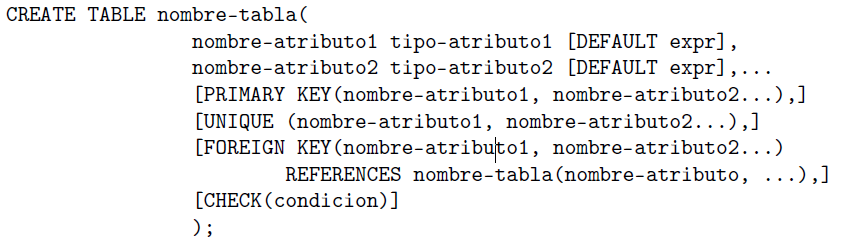
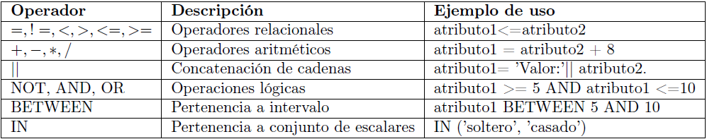
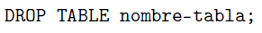
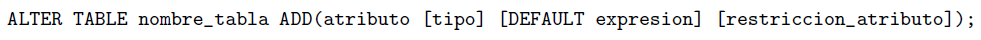
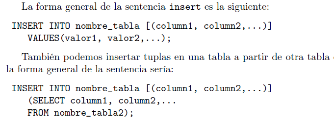
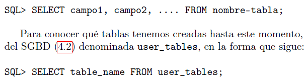
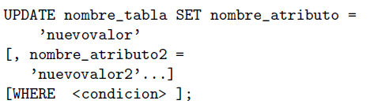
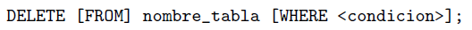
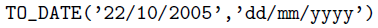

# Fichero para el Estudio Rapido de FBD

Aqui voy a poner todas las ordenes de SQL que permitan de aprender lo necesario para el examen de practica de FBD.

## Unidad Didactica 2: Creación y Gestión de BD

#### Creaccion de una tabla

#### Operadores SQL 

#### Borrar una tabla

#### Modificacion esquema

Para borrar un atributo de la tabla:
    ALTER TABLE nombre-tabla DROP nombre-atributo;

#### Inserción tuplas en tablas

#### Mostrar contenido tabla

#### Modificar contenido tabla

#### Borrado de tuplas

#### Funcion TO_DATE

## Unidad Didactica 3: Realización de consultas a una base de datos

#### 

#### 

#### 

#### 