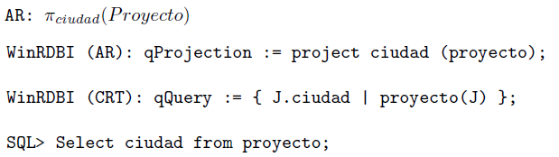

# Fichero para el Estudio Rapido de FBD

Aqui voy a poner todas las ordenes de SQL que permitan de aprender lo necesario para el examen de practica de FBD.

## Unidad Didactica 2: Creación y Gestión de BD

#### Creaccion de una tabla

#### Operadores SQL 

#### Borrar una tabla

#### Modificacion esquema

Para borrar un atributo de la tabla:
        ALTER TABLE nombre-tabla DROP nombre-atributo;

#### Inserción tuplas en tablas

#### Mostrar contenido tabla

#### Modificar contenido tabla

#### Borrado de tuplas

#### Funcion TO_DATE

## Unidad Didactica 3: Realización de consultas a una base de datos

#### Sintaxis de SELECT para consultas = Proyección AR

Es el equivalente del operador _pi_ en AR.

El verdadero resultado del _pi de la AR se obtiene con el operador DISTINCT que quita las repeticiones.

#### Operador WHERE = Selección AR

Hay unos operadores logicos que puedan ayudar en las busquedas:
- LIKE para comparar cadenas de caracteres
- Caracteres comodín **_** para un caracter o **%** para una cadena de 0 o mas caracteres.
- Operador IS NOT NULL

Una sintaxis de ejemplo podría ser:
        SELECT codpro, nompro FROM proveedor WHERE ciudad LIKE 'L%';
        SELECT codpro, nompro FROM proveedor WHERE ciudad LIKE 'L_N%';
        SELECT codpro, nompro FROM proveedor WHERE ciudad IS NOT NULL;
#### Consulta sobre catalogo

Le se puede añadir una selección con el operador WHERE como si fuera una cualquiera consulta.

#### Operadores de AR: UNION | UNION ALL | INTERSECT | MINUS

#### Producto cartesiano

#### Renombramiento o aliasing

#### Reunion Natural = NATURAL JOIN

#### Ordenacion de resultados = ORDER BY

#### Subconsultas en SQL

##### Operador de pertenencia IN

##### Operador de existencia EXISTS

##### Otros operadores: comparadores de conjuntos

#### Division AR

A partir de esta formula, tenemos tres posibles aproximaciones:

1) definicion en AR

2) basada en CR

3) mixta con NOT EXISTS

#### Funciones de agregación [ SUM(), MIN(), MAX(), AVG(), COUNT(), STDDEV() ]

En las consultas de tipo SELECT se pueden usar funciones de agregacion para sacar un valor particular de una tabla o de una subconsulta:
        SELECT MAX(cantidad) FROM ventas;
        
#### 