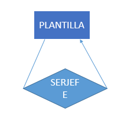

#### Ejercicios Cuaderno FBD (practica)

#####Ejercicio 2.1
contenido del fichero pp.sql:

        CREATE TABLE prueba2(
                cad1 char(8),
                num int
            );

#####Ejercicio 2.2

#####Ejercicio 2.3
Lista completa de los datatypes ofrecidos por Oracle:
- CHAR (size [BYTE|CHAR])
- NCHAR (size)
- VARCHAR2 (size [BYTE|CHAR])
- NVARCHAR2 (size)
- NUMBER [ (p [, s]) ]
- FLOAT [(p)]
- LONG
- DATE
- BINARY_FLOAT
- BINARY_DOUBLE
- TIMESTAMP [(fractional_seconds_precision)]
- TIMESTAMP [(fractional_seconds_precision)] WITH TIME ZONE
- TIMESTAMP [(fractional_seconds_precision)] WITH LOCAL TIME ZONE
- INTERVAL YEAR [(year_precision)] TO MONTH
- INTERVAL DAY [(day_precision)] TO SECOND [(fractional_seconds_precision)]
- RAW(size)
- LONG RAW
- ROWID
- UROWID[(size)]
- CHAR [(size [BYTE | CHAR])]
- NCHAR[(size)]
- CLOB
- NCLOB
- BLOB
- BFILE

#####Ejercicio 2.4
El diagrama E/R que recoge la semantica de las tablas _planitlla_ y _serjefe_ es muy sencillo: _serjefe_ es una relacion involutiva de _plantilla_, relacion de uno a mucho en la que un elemento de _plantilla_ (identificado por _dnijefe_) puede SER JEFE de muchos otros elementos de _plantilla_ (identificados por _dnitrabajador_).

#####Ejercicio 2.5

Una vez borrada la tabla _prueba1_, se puede ejecutar una query _SELECT_ para ver todas las tablas que se quedan 

        DROP TABLE prueba1;
        SELECT table_name FROM user_tables;

#####Ejercicio 2.6

        ALTER TABLE plantilla ADD(fechabaja DATE);

#####Ejercicio 2.7

        ALTER TABLE ventas ADD(fecha DATE);

